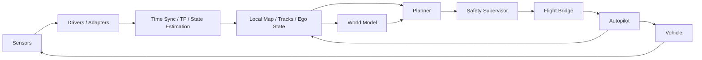

# 无人机世界模型通用架构

## 1. 文档定位

这份文档描述的是**跨场景共用**的系统架构，不绑定某一个具体环境、某一种传感器组合，也不绑定某一个具体飞控。

它回答的是通用问题：

- 世界模型系统应该分成哪些层
- 哪些能力属于通用核心
- 哪些能力应该留给场景适配层
- 高层智能与底层飞控之间如何划边界

如果某些内容只适用于特定场景，例如“室内无 GPS + 激光雷达 SLAM + ArduPilot”，应放到 `docs/scenarios/` 下。

## 2. 总体目标

本项目中的“世界模型”不是泛化通用智能模型，而是一个面向无人机任务的、可在线更新的环境内部表示系统。它的职责是：

- 消费多源观测，构建局部环境状态
- 维护自机状态与周围对象状态
- 预测短时未来变化
- 为任务决策和局部规划提供风险、可通行性和轨迹评分
- 在不替代飞控底层稳定控制的前提下，提升自主性

首版目标依然不是直接输出电机级控制，而是支撑可验证的高层闭环。

## 3. 通用分层

建议把系统拆成六层：

1. 感知接入层
2. 状态估计与状态构建层
3. 世界模型层
4. 任务与规划层
5. 安全裁决层
6. 飞控桥接与执行层

### 3.1 感知接入层

职责：

- 接入雷达、视觉、IMU、GPS、气压计、测距仪等传感器
- 提供统一时间戳和设备健康状态
- 向上提供标准化原始观测

这一层尽量不写任务逻辑。

### 3.2 状态估计与状态构建层

职责：

- 时间同步
- 坐标变换
- 状态估计
- 局部地图构建
- 动态目标跟踪

这一层负责把“原始观测”转成“可决策的结构化状态”。

### 3.3 世界模型层

职责：

- 汇聚过去若干时刻的结构化状态
- 建立环境演化的内部表示
- 输出未来占据、风险、轨迹预测或候选动作评分

这一层应优先输出结构化结果，而不是直接出底层控制量。

### 3.4 任务与规划层

职责：

- 把高层目标转成局部子目标
- 生成位置、速度、轨迹或航点级命令
- 消费世界模型输出和当前环境状态

建议把“任务层”和“局部规划层”分开，避免语义目标和运动约束混在一起。

### 3.5 安全裁决层

职责：

- 对所有外发命令做最终校验
- 进行风险检查、限幅、超时检测和降级决策
- 在系统异常时切换到保守策略

安全层必须独立存在，不能被模型或规划器绕过。

### 3.6 飞控桥接与执行层

职责：

- 把高层命令转换成飞控可接受的接口
- 接收飞控反馈、ACK、模式和健康状态
- 保持飞控对姿态、电机和 failsafe 的主导权

这层的核心思想是：高层系统给出“该怎么走”，飞控负责“怎么稳地执行”。

## 4. 通用数据流

这个数据流适用于多个场景，只是不同场景下：

- 传感器会不同
- 状态估计方法会不同
- 世界模型输入会不同
- 飞控桥接方式会不同

但分层关系应尽量稳定。

## 5. 为什么不建议一开始端到端

对于无人机系统，直接从原始传感器到控制量的端到端方案在工程上有几个问题：

- 调试困难
- 可解释性差
- 数据成本高
- 安全验证困难
- 失效边界不清晰

因此推荐首版采用两段式思路：

- 世界模型负责建模和预测
- Planner + Safety 负责把预测结果变成可执行命令

## 6. 世界模型的通用输入输出

### 输入

通用输入可包括：

- 局部地图
- 障碍物跟踪结果
- 自机状态
- 任务上下文
- 历史状态序列

不同场景可以有不同传感器来源，但应尽量统一成相似的中间表示后再进入世界模型。

### 输出

推荐优先输出：

- 未来占据预测
- 风险热图
- 目标轨迹预测
- 候选轨迹评分
- 可通行区域或约束提示

不推荐首版直接输出：

- 电机命令
- 姿态控制量
- 绕过飞控安全边界的直接动作

## 7. 控制边界

建议明确以下控制边界：

- 世界模型不直接控机
- Planner 不绕过 Safety Supervisor
- Safety Supervisor 不绕过飞控本身的保护机制
- 飞控继续负责姿态稳定、电机控制、基础导航和 failsafe

控制权优先级建议为：

`Safety Supervisor > Human Override > Planner > World Model`

## 8. 多场景设计原则

为了支持多个场景长期共存，建议坚持以下原则：

- 通用模块优先放在核心层，不写死场景假设
- 场景差异通过配置、适配器和场景目录管理
- 任何场景专属约束不要污染通用架构文档
- 通用接口尽量稳定，场景变化尽量收敛在边界层

例如：

- 室内场景可能依赖 SLAM
- 室外场景可能依赖 GPS + VIO
- 仓储场景可能依赖 2D 激光雷达 + 地图约束

这些都应被视为“状态估计和场景适配差异”，而不是顶层架构分层差异。

## 9. 部署职责切分

当前仍沿用双环境思路：

### 源平台

职责：

- 数据整理
- 训练与评估
- 模型导出
- 离线回放

### 机载计算盒子

职责：

- ROS2 运行时节点
- 在线推理
- 规划与安全裁决
- 飞控桥接
- 在线日志和诊断

机载侧不承担重训练任务。

## 10. 架构结论

对这个仓库来说，更重要的不是先定义某一个场景下的最优算法，而是先建立一套能承载多个场景的稳定分层：

- 通用分层稳定
- 场景特化可替换
- 世界模型和飞控边界清晰
- 安全层始终独立

在这个前提下，当前室内场景只是第一批落地实例，而不是整个仓库架构的唯一中心。

## 11. 相关文档

- 接口边界见 `docs/general/ros2_interfaces.md`
- 安全边界见 `docs/general/safety_and_validation.md`
- 仓库落位见 `docs/general/repository_structure.md`
- 当前室内场景映射见 `docs/scenarios/indoor/architecture.md`
