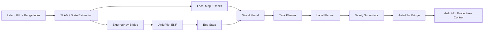

# 室内场景架构

## 1. 场景定位

这个目录描述的是当前正在推进的第一个明确场景：

- 室内飞行
- 无 GPS
- 以激光雷达 / SLAM 作为主要定位来源
- 与 ArduPilot 对接

这份文档不是顶层通用架构，而是把通用架构映射到当前室内场景下，回答“这个场景下系统到底怎么拆”。

## 2. 场景目标

当前室内场景的核心目标不是直接做一个端到端黑盒，而是先构建一个可验证、可回放、可降级的闭环：

`Lidar / IMU / Rangefinder -> SLAM / State Estimation -> World Model -> Planner -> Safety -> ArduPilot`

重点是：

- 在室内无 GPS 条件下获得连续位置和速度估计
- 基于局部环境状态做规划和避障
- 把高层决策映射到 ArduPilot 可执行的高层控制接口
- 保留飞控对姿态和底层稳定控制的主导权

## 3. 场景特有约束

这个场景与其他场景最不同的地方在于：

- 不能依赖常规 GPS
- 状态估计高度依赖 SLAM 或其他 External Navigation 能力
- 坐标系转换和时间同步会直接影响飞行稳定性
- 定位估计必须持续、稳定、低延迟
- 室内环境更强调局部避障和近场风险控制

因此当前场景里有两个核心闭环：

1. 定位闭环
2. 决策闭环

## 4. 室内场景分层

### 4.1 传感器与定位层

职责：

- 接入激光雷达、IMU、测距仪、气压计等
- 做时间同步和外参管理
- 运行 SLAM / LIO / 点云配准
- 输出连续位姿、速度、姿态和局部地图

这层是室内飞行能否成立的基础。

### 4.2 External Navigation 桥接层

职责：

- 把 SLAM 输出的位姿和速度转换成飞控可融合的外部导航输入
- 管理坐标系转换、协方差、时间戳、重定位处理
- 持续向 ArduPilot 提供外部导航估计

这一层是室内场景特有的关键层。

### 4.3 世界状态构建层

职责：

- 构建局部地图
- 提取自由空间
- 管理动态障碍轨迹
- 整理自机状态

这层把定位和原始观测整理成上层可消费的结构化状态。

### 4.4 世界模型层

职责：

- 消费局部地图、障碍轨迹和自机状态
- 输出短时风险、占据预测、候选方向评分或轨迹评分

首版依然建议输出结构化结果，不直接输出飞控控制量。

### 4.5 任务与规划层

职责：

- 把语义目标转成局部子目标
- 根据当前风险和局部环境生成轨迹或 setpoint

可以分成：

- `task planner`
- `local planner`

### 4.6 安全与飞控执行层

职责：

- 对规划输出做最终检查
- 处理超时、障碍风险、飞控异常、定位异常
- 向 ArduPilot 发送最终允许执行的命令

## 5. 室内场景数据流

上图中有两个不能混淆的闭环：

- `SLAM -> ExternalNav -> ArduPilot EKF`
- `World Model -> Planner -> Safety -> ArduPilot`

## 6. 当前场景下的控制边界

建议明确以下边界：

- SLAM 负责“我在哪里、我怎么动”
- 世界模型负责“周围是什么、未来风险如何”
- Planner 负责“下一步应该怎么走”
- Safety 负责“这条命令能不能发”
- ArduPilot 负责“怎么稳地执行”

当前阶段不建议：

- 让世界模型直接输出姿态控制
- 让规划器绕过安全层
- 让伴飞计算机直接替代飞控底层稳定控制

## 7. 室内场景最关键的工程风险

建议优先关注这些问题：

- 坐标系映射错误
- 时间戳漂移或跳变
- SLAM 回环导致位姿突变
- 外部导航输入不连续
- 局部地图延迟过高
- 规划输出超时
- 传感器临时中断

这些问题在室内场景下通常比“模型够不够强”更先决定系统能否飞起来。

## 8. 当前场景结论

室内无 GPS 场景应该被视为这个仓库的第一个场景实例，而不是整个仓库的唯一中心。

在这个场景下，最重要的不是先做最复杂的模型，而是先把以下主线跑通：

- 稳定定位
- 连续 External Navigation
- 局部地图与风险表示
- 规划与安全闭环
- ArduPilot 高层控制执行

## 9. 相关文档

- 顶层共性分层见 `docs/general/architecture.md`
- 通用接口边界见 `docs/general/ros2_interfaces.md`
- 通用安全边界见 `docs/general/safety_and_validation.md`
- 当前场景里程碑见 `docs/scenarios/indoor/mvp_plan.md`
- 当前场景详细评审见 `docs/scenarios/indoor/ardupilot_slam_design.md`
