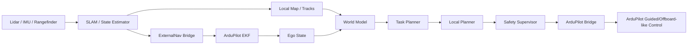

# 室内无人机 + 激光雷达 SLAM + ArduPilot + 世界模型设计评审

## 1. 背景

当前设想是：

- 机体上已经有激光雷达，可输出点云或扫描数据。
- 飞行场景主要在室内，无法依赖常规 GPS。
- 无人机厂商建议如果继续使用 ArduPilot，需要给飞控持续提供“可替代 GPS 的位置与速度来源”。
- 这一路位置、姿态、速度估计希望通过 SLAM 获得。
- 世界模型消费 SLAM 和环境感知结果，做高层决策。
- 决策结果再映射成 ArduPilot 所需的控制接口，形成从高层语义到底层飞控命令的链路。

这个方向总体是合理的，但工程上有一个非常关键的边界：

**对于 ArduPilot 室内飞行，更准确的说法不是“模拟 GPS”，而是给飞控提供 External Navigation / Non-GPS Position Estimation。**

根据 ArduPilot 官方文档，室内无 GPS 场景支持把外部位置和速度估计送入 EKF，推荐使用 MAVLink `ODOMETRY`，`GPS_INPUT` 反而是不推荐的做法。

## 2. 总体判断

### 结论

你的总体思路是对的，尤其是下面三点方向正确：

1. **用 SLAM 解决室内定位与速度估计**，让飞控仍然可以工作在“有位置闭环”的模式。
2. **让世界模型站在 SLAM 之上做决策**，而不是让世界模型直接替代飞控稳定控制。
3. **把高层语义映射成 ArduPilot 接受的标准控制接口**，而不是直接输出电机级控制量。

### 但需要改正或澄清的地方

1. **不要把核心方案定义成“伪造 GPS”**
   - 更推荐的表述和实现是：`SLAM -> ExternalNav -> ArduPilot EKF`
   - 如果一开始就按“假 GPS”理解，后续容易在坐标系、模式切换、故障处理上走偏。

2. **世界模型不应该直接等于 SLAM**
   - `SLAM` 解决“我在哪里、我怎么动”。
   - `世界模型` 解决“周围是什么、未来会怎样、下一步该怎么走”。
   - 两者关系是前者给后者提供状态基础，而不是合成一个黑盒模块。

3. **从高层语义到底层指令，中间至少要再加一层 Planner / Safety Supervisor**
   - 高层语义示例：`去 A 点`、`巡检 B 区域`、`绕开前方动态障碍`
   - 飞控接口示例：位置 setpoint、速度 setpoint、局部航点、短时轨迹
   - 中间需要一个确定性的轨迹/控制层，把语义目标变成局部可执行命令。

4. **SLAM 输出必须是持续、稳定、低延迟的状态流，而不是偶尔给一个坐标**
   - ArduPilot 官方要求外部位置估计消息持续发送，`ODOMETRY` 是推荐方式，发送频率至少要到 `4 Hz` 以上。
   - 实际工程建议把室内飞行的外部位姿更新做到 `10-30 Hz`，否则控制体验和安全裕度都偏弱。

## 3. 推荐的职责分层

建议把系统拆成五层，而不是把所有能力压成一个“大模块”。

### A. 传感器与定位层

职责：

- 激光雷达驱动
- IMU / 气压计 / 测距仪接入
- 时间同步
- 外参管理
- 激光雷达 SLAM / LIO / 点云配准
- 输出连续位姿、速度、局部地图

核心输出：

- 自机位姿 `pose`
- 自机速度 `twist`
- 置信度 / 协方差
- 局部点云或占据图
- 定位健康状态

### B. ExternalNav 桥接层

职责：

- 把 SLAM 的位姿和速度转换成 ArduPilot 可融合的外部导航输入
- 负责坐标系转换、时间戳、协方差、重定位/跳变处理
- 通过 MAVLink 持续发送 `ODOMETRY` 或兼容接口

这是飞控闭环能否稳定工作的关键中间层。

### C. 世界模型层

职责：

- 基于局部地图、动态障碍、自机状态构建可决策的环境表示
- 估计风险、可通行区域、动态目标趋势
- 为 Planner 提供结构化输出，而不是直接给飞控发命令

推荐输出：

- 局部占据表示
- 动态目标轨迹
- 风险热图
- 候选方向/走廊评分
- 短时未来占据预测

### D. 任务与规划层

职责：

- 把“高层语义目标”变成“局部轨迹或 setpoint”
- 例如从“去房间左侧门口”转成一串局部路径点、速度约束、朝向约束

推荐拆成两层：

- `mission/task planner`：理解目标、选局部目标点
- `local planner`：结合世界模型输出生成局部轨迹

### E. 安全与飞控执行层

职责：

- 命令限幅
- 碰撞前瞻检查
- 数据超时检测
- 模块故障降级
- 向 ArduPilot 发送最终高层控制命令

这一层必须独立于世界模型，不能被模型绕过。

## 4. 推荐数据流

上图里有两个闭环：

1. **定位闭环**：`SLAM -> ExternalNav -> ArduPilot EKF`
2. **决策闭环**：`感知/世界模型 -> Planner -> Safety -> ArduPilot`

这两个闭环不要混成一个，否则很难调试。

## 5. 为什么“SLAM 输入世界模型，再输出 ArduPilot 指令”这个思路基本合理

因为这符合无人机系统常见的控制边界：

- `SLAM` 负责状态估计
- `世界模型` 负责环境理解与预测
- `Planner` 负责动作生成
- `ArduPilot` 负责姿态稳定和底层执行

如果直接让世界模型输出滚转、俯仰、油门，风险会明显变高：

- 调试困难
- 可解释性差
- 失效边界不清晰
- 室内测试成本很高
- 很难做逐步上线

所以更合适的方式是：

`高层语义 -> 局部目标/轨迹 -> 安全裁决 -> ArduPilot setpoint`

而不是：

`高层语义 -> 电机控制`

## 6. 这套设计里最容易踩坑的地方

### 6.1 把“室内定位”误解成“发一个假 GPS”

这是最需要纠正的点。

ArduPilot 官方开发文档明确给出了 Non-GPS Position Estimation 路线：

- 推荐消息：`ODOMETRY`
- 可选消息：`VISION_POSITION_ESTIMATE`、`VISION_SPEED_ESTIMATE` 等
- 不推荐：`GLOBAL_VISION_POSITION_ESTIMATE`
- 不推荐：`GPS_INPUT`

所以如果厂商口头上说“模拟 GPS”，你在系统设计文档里最好改成：

- `外部导航估计输入飞控 EKF`
- 或 `SLAM-based External Navigation`

这样后续实现会更清晰。

### 6.2 坐标系转换会出错

ROS 世界里常见的是 `map / odom / base_link` 和 ENU/FLU 习惯；
ArduPilot / MAVLink 常见的是 NED/FRD 习惯。

官方文档中 `ODOMETRY` 相关字段明确写了：

- 可使用 `MAV_FRAME_BODY_FRD` 或 `MAV_FRAME_LOCAL_FRD`
- `z` 轴正方向是 `down`

这意味着你至少要明确处理：

- `ENU -> NED`
- `FLU -> FRD`
- 四元数朝向变换
- 线速度和角速度变换

很多系统不是“算法不行”，而是坐标系接错后根本飞不稳。

### 6.3 SLAM 回环或重定位会产生跳变

飞控喜欢“连续的小误差”，不喜欢“突然的位置跳变”。

但 SLAM 尤其带回环优化时，可能出现：

- 位姿瞬间跳变
- 轨迹整体平移
- yaw 突然校正

这会直接影响 EKF 融合和控制稳定性。

建议：

- 给飞控的 `ExternalNav` 使用**连续里程计坐标系**，不要直接喂会突变的全局优化结果。
- 把回环优化后的全局 `map` 留给建图和离线分析。
- 若估计器发生重置，正确维护 `reset_counter` 或触发受控重定位逻辑。

### 6.4 如果你现在用的是 2D 激光雷达，要重新检查三维可观测性

这一点非常关键。

如果你的雷达其实是 2D 激光雷达，那么它天然更擅长提供：

- 平面内 `x`
- 平面内 `y`
- 航向 `yaw`

但对于无人机室内飞行，还需要稳定的：

- 高度 `z`
- 垂直速度 `vz`
- 俯仰/横滚相关约束

所以：

- **3D 激光雷达 / 深度相机 + IMU** 更适合完整三维定位。
- **2D 激光雷达** 通常还需要 IMU、测距仪、气压计，甚至额外视觉，才能形成靠谱的 3D 外部导航。

如果当前硬件确实是仓库里这类 YDLidar 2D 扫描方案，那么“直接依赖 SLAM 输出完整三维状态给飞控”风险会偏高。

### 6.5 世界模型不要直接消费“全量大地图”

世界模型用于在线决策时，更适合消费：

- 最近若干秒状态历史
- 机体周围局部地图
- 障碍物跟踪结果
- 当前任务目标

不建议一开始把整个全局 SLAM 地图都喂进去，因为：

- 计算压力大
- 延迟高
- 动态场景中收益不明显
- 在线系统更关心局部可行动作，而不是一次性理解整个建筑

## 7. 建议的接口边界

### SLAM 输出给 ExternalNav

建议字段：

- 时间戳
- `pose`
- `twist`
- 姿态四元数
- 位置协方差
- 姿态协方差
- 质量分数
- 是否发生重定位 / reset

### ExternalNav 输出给 ArduPilot

优先方案：

- `MAVLink ODOMETRY`

原因：

- ArduPilot 官方标记为 preferred method
- 可以同时带位置、速度、姿态、角速度、协方差、质量
- 更适合做稳定融合和健康判断

### 世界模型输出给 Planner

建议不要输出“飞控函数名”，而是输出结构化中间语义：

- 局部目标点
- 候选走廊/通行区域
- 风险图
- 障碍未来占据
- 候选轨迹评分

### Planner / Safety 输出给 ArduPilot

建议优先使用高层局部控制接口，例如：

- 局部位置 setpoint
- 局部速度 setpoint
- 短时轨迹点

按照 ArduPilot Guided 模式开发文档，这类控制通常映射到 `SET_POSITION_TARGET_LOCAL_NED` 一类的高层 MAVLink 指令，比“伪造全局 GPS 目标点”更适合室内。

## 8. 一个更稳妥的模块映射方案

### 高层语义层

输入示例：

- `起飞到 1.5m`
- `前往检测点 A`
- `沿走廊巡检`
- `绕开前方障碍`

输出示例：

- 任务阶段
- 局部目标点
- 速度上限
- 航向偏好

### 世界模型层

输入：

- SLAM 位姿
- 局部点云 / 占据图
- 动态目标跟踪
- 飞控状态

输出：

- 局部通行性
- 风险分数
- 未来障碍占据
- 候选子目标评分

### 局部规划层

输入：

- 世界模型输出
- 当前位姿
- 当前速度
- 任务目标

输出：

- 未来 1-3 秒局部轨迹
- 下一控制周期的 position / velocity setpoint

### 安全裁决层

输入：

- 局部轨迹
- 飞控健康状态
- ExternalNav 新鲜度
- 传感器状态

输出：

- 允许执行的最终 setpoint
- 降级事件
- 悬停 / 刹停 / 降落 / 接管建议

## 9. 首版 MVP 建议

### 阶段 0：只验证室内定位闭环，不做世界模型

目标：

- 激光雷达 + IMU 跑通 SLAM
- 把位姿速度持续送给 ArduPilot
- 让飞控能够在室内稳定获取位置估计

验收标准：

- 外部导航输入稳定，无明显超时
- 室内悬停或低速移动可控
- 坐标系转换正确
- 日志中 EKF 不频繁报错

### 阶段 1：加入局部地图和基础避障

目标：

- 基于点云或占据图做简单局部避障
- 先不用学习世界模型，使用规则方法或代价地图即可

验收标准：

- 能绕开静态障碍
- 命令链路稳定
- 安全层可在数据超时或障碍突发时触发刹停/悬停

### 阶段 2：引入世界模型做风险预测或轨迹评分

目标：

- 世界模型消费多帧局部状态
- 输出未来短时风险或候选轨迹评分

验收标准：

- 比规则方法更早识别潜在碰撞趋势
- 在动态场景下改善局部决策质量
- 模型失效时系统仍可回退到规则 Planner

## 10. 推荐 ROS2 节点草图

- `lidar_driver_node`
- `imu_bridge_node`
- `slam_node`
- `external_nav_bridge_node`
- `ego_state_node`
- `local_map_node`
- `tracking_node`
- `world_model_node`
- `task_planner_node`
- `local_planner_node`
- `safety_supervisor_node`
- `ardupilot_bridge_node`

建议话题方向：

- `/slam/odometry`
- `/slam/pose`
- `/slam/status`
- `/world/local_map`
- `/world/tracks`
- `/world/risk_map`
- `/planner/local_trajectory`
- `/flight/command`
- `/flight/status`
- `/flight/health`

## 11. 你这个设计是否合理：一句话版本

**合理，但前提是要把“伪造 GPS”改成“SLAM 驱动的 ExternalNav”，并把系统明确拆成 `定位 -> 世界模型 -> 规划 -> 安全 -> ArduPilot` 五层。**

如果这样拆，设计是工程上可落地的；如果把 SLAM、世界模型、规划、飞控桥混成一个大黑盒，后面大概率会很难调试。

## 12. 对当前项目的建议落点

结合本仓库已有文档，建议把本方案视为对现有架构的一个“室内无 GPS 特化场景补充”：

- `docs/architecture.md` 已经定义了世界模型、规划、安全和飞控桥的大框架。
- 本文档补充的是“室内场景下定位闭环如何接到 ArduPilot”。
- 后续如果开始实现，建议优先补一份 `external_nav_bridge` 的接口和坐标系说明文档。

## 13. 官方资料参考

- ArduPilot Non-GPS Navigation:
  - https://ardupilot.org/copter/docs/common-non-gps-navigation-landing-page.html
- ArduPilot Non-GPS Position Estimation / ExternalNav:
  - https://ardupilot.org/dev/docs/mavlink-nongps-position-estimation.html
- ArduPilot Guided Mode MAVLink Commands:
  - https://ardupilot.org/dev/docs/copter-commands-in-guided-mode.html
- ArduPilot Cartographer SLAM for Non-GPS Navigation:
  - https://ardupilot.org/dev/docs/ros-cartographer-slam.html

## 14. 相关文档

- 当前场景架构见 `docs/scenarios/indoor/architecture.md`
- 当前场景阶段路线见 `docs/scenarios/indoor/mvp_plan.md`
- 顶层通用架构见 `docs/general/architecture.md`
- 通用接口边界见 `docs/general/ros2_interfaces.md`
- 通用安全边界见 `docs/general/safety_and_validation.md`
